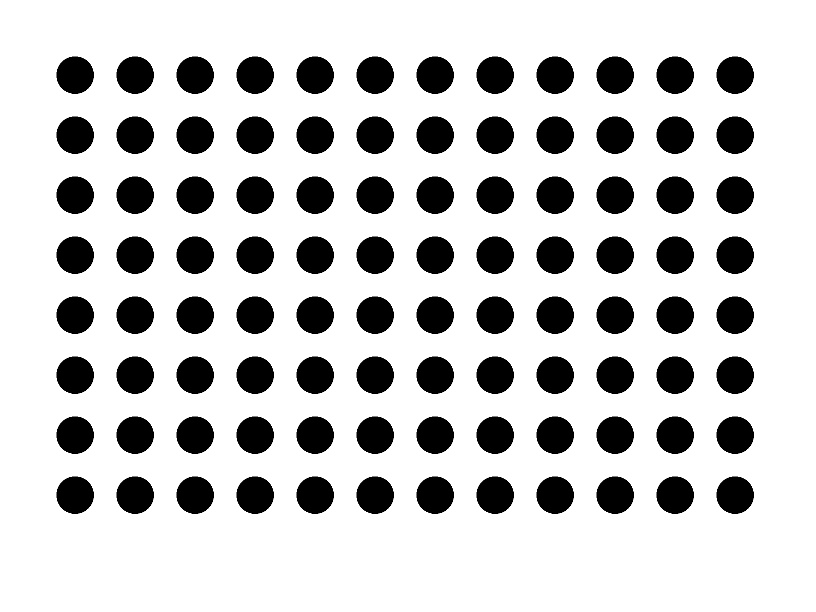
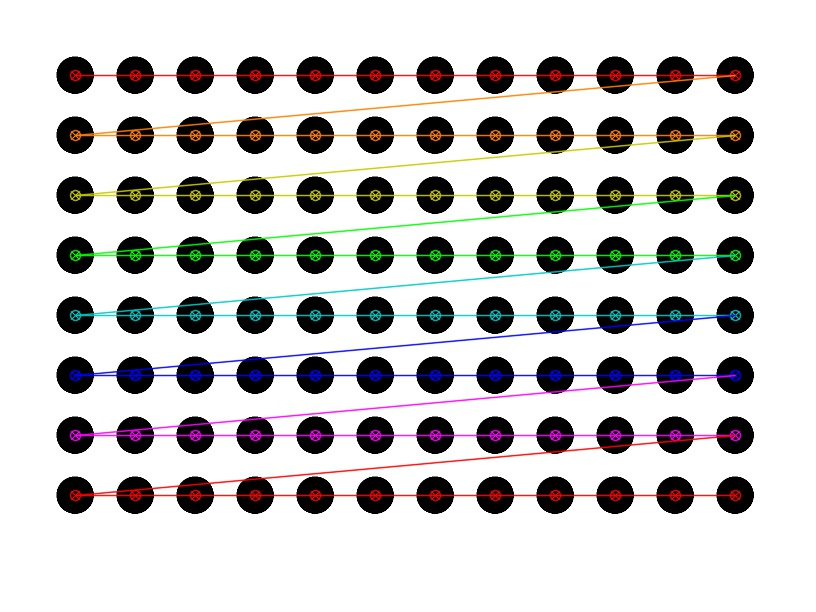

# FeatureDetection
Python code which illustrates how to detect features for typical calibration tasks.

### Starting Image
A calibration target from the internet with cirlces and a grid shape of
* with = 12
* height = 10

### Detection of feature

### Finished result

![test][target.jpg]
